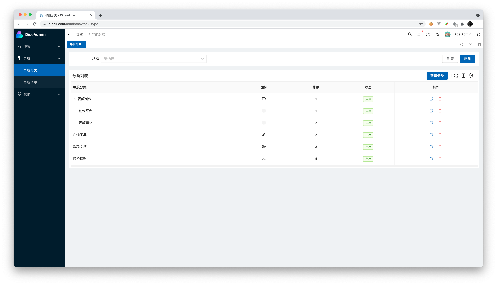
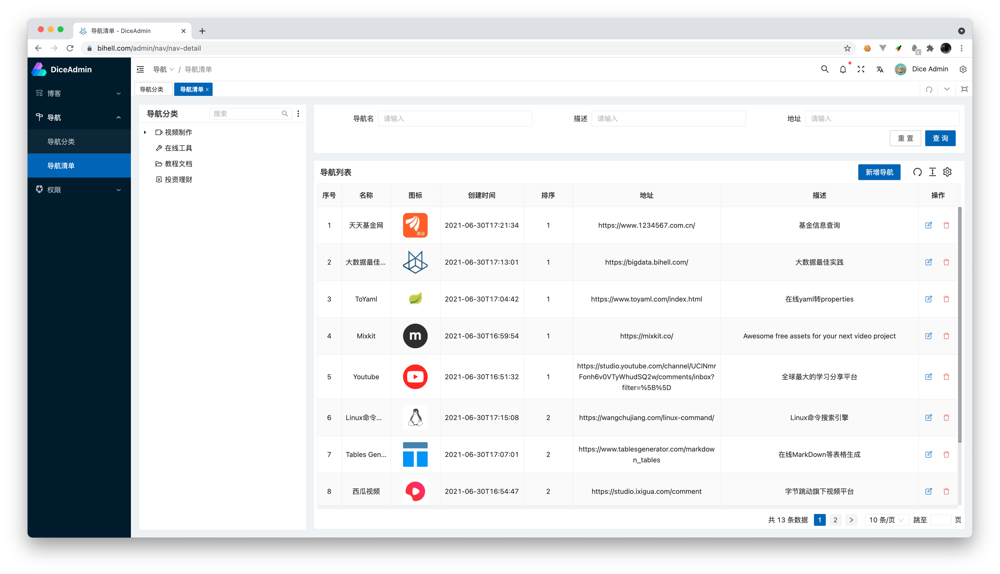
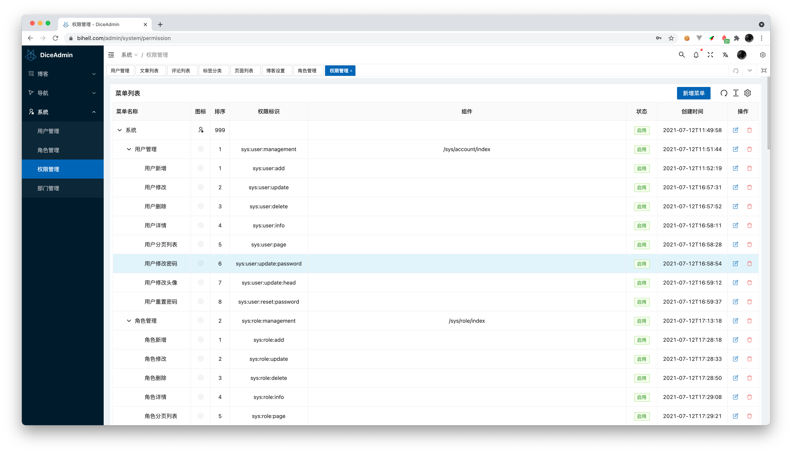

<p align="center">
  
</p>
<p align="center">
    <a href="https://www.travis-ci.org/bihell/Dice"></a>
    <a href="https://codebeat.co/projects/github-com-bihell-dice-master"></a>
    <a href="https://github.com/bihell/Dice/blob/master/LICENSE"></a>
    <a alt="spring boot"></a>
    <a alt="spring boot"></a>
    <a alt="vue"></a>
    <a alt="nuxt"></a>
    <a alt="docker"></a>
    <a alt="docker-compose"></a>
</p>


* 基于`node` `java` `spring-boot` `vue` `nuxt` 开发的个人管理系统: 目前有博客、导航、权限管理三大模块.其中博客除了管理前端外还有SEO前端
* 功能精简但齐全，界面简洁却美观，满足个人日常使用要求
* 项目会持续更新，如果有不完善的地方，欢迎指出

> 演示站点： 
> [博客前端](https://www.bihell.com:8082/)  [管理前端](https://www.bihell.com:8082/admin/) 
> 演示账号：
> 普通用户：demo 123456
> 管理员：dice 123456

> Discord群：https://discord.gg/rsxxPfpw8m
> QQ交流群：787519476

## 一、部分界面

<table>
    <tr>
        <td>
            
        </td>
        <td>
            
        </td>
    </tr>
    <tr>
        <td>
            
        </td>
        <td>
            
        </td>
    </tr>
    <tr>
        <td>
            
        </td>
        <td>
            
        </td>
    </tr>
    <tr>
        <td>
            
        </td>
        <td>
            
        </td>
    </tr>
</table>

## 二、项目结构

```
Dice
├── dice-admin        --  后台管理前端，基于vue-vben-admin项目开发。
├── dice-front        --  博客SEO前端，基于vue-next项目开发
└── dice-server       --  后端服务，Spring Boot全家桶
    ├── admin         --  SpringBootAdmin Server模块
    ├── blog          --  博客模块
    ├── bootstrap     --  启动模块
    ├── config        --  配置模块
    ├── distribution  --  打包模块
    ├── framework     --  框架核心模块
    ├── generator     --  代码生成模块
    ├── nav           --  导航模块
    └── system        --  系统模块
```

## 三、参与开发

目前管理前端刚切为vue3，很多功能细节需要完善。欢迎大家参与进来

> 请确保系统中已经安装`docker`、`docker-componse`、`nodejs`、`npm`、`Java8`、`Redis`、`MySQL`等必须的依赖。

### 3.1 安装依赖（MacOS）

#### Java

Java8 及以上

```Bash
brew tap homebrew/cask-versions
brew cask install java11
```

#### MySQL

```Bash
brew install mysql
mysql.server start
```

> 如果你的MySQL版本较新，可能会碰到无法连接的错误。可以重新设置一下账号权限，方式如下：

> ```
> ALTER USER 'root'@'localhost' IDENTIFIED WITH mysql_native_password BY 'password'
> flush privileges;
> ```

#### Redis

```Bash
brew install redis
brew services start redis
```

### 3.2 启动运行

克隆项目到本地

   ```
   git clone https://github.com/bihell/Dice.git
   ```

#### 3.2.1 `dice-server` Java后台

项目使用lombok插件，如果要在ide中调试要有lombok插件
数据库初始语句:`dice-server/bootstrap/src/main/resources/init.sql`

##### 修改相应配置

进入服务端文件夹`cd dice-server`,修改spring-boot配置文件`vi src/main/resources/application-dev.properties`

```
spring:
    datasource:
      driverClassName: com.mysql.cj.jdbc.Driver
      url: jdbc:mysql://localhost:3306/dice?useUnicode=true&characterEncoding=utf-8&useSSL=false&serverTimezone=Asia/Shanghai
      username: root
      password: root
```

将数据库的用户名和密码修改成对应你数据库的用户名密码

##### 项目启动

多种启动方式：

1. 直接运行main方法

直接在IDE中运行`bootstrap`模块的`DiceApplication`启动类的main方法就可以看到项目启动了。

2. 打包启动

```Bash
mvn clean package -P docker,release
java -jar bootstrap/target/bootstrap-2.0.jar
```

#### 3.2.2 `dice-front` 博客前端

进入前端文件夹`cd dice-front`，安装依赖并启动服务：

```Bash
npm install
npm run dev
```

#### 3.2.3 `dice-admin` 管理前端

进入后端文件夹`cd dice-admin`，安装依赖和启动服务：

```Bash
npm install -g pnpm
pnpm install
pnpm dev
```

#### 3.2.4 访问

`http://localhost:3000/` 为博客前端首页

`http://localhost:3100/admin/` 为管理后台首页

## 四、特别感谢

感谢 JetBrains 提供的免费开源 License：


