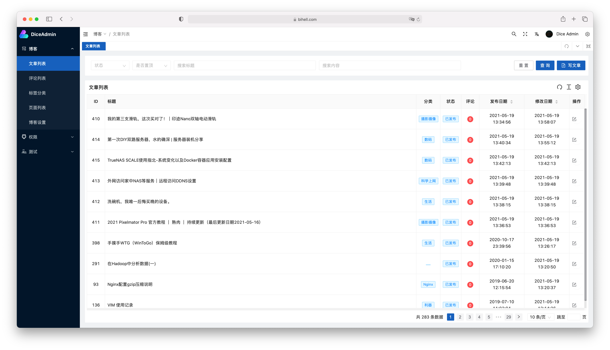
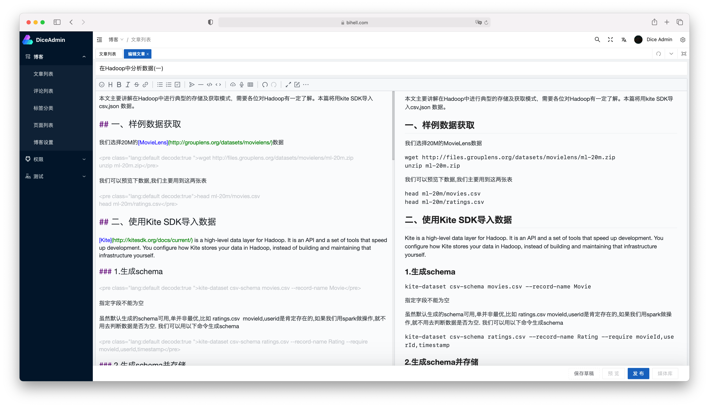
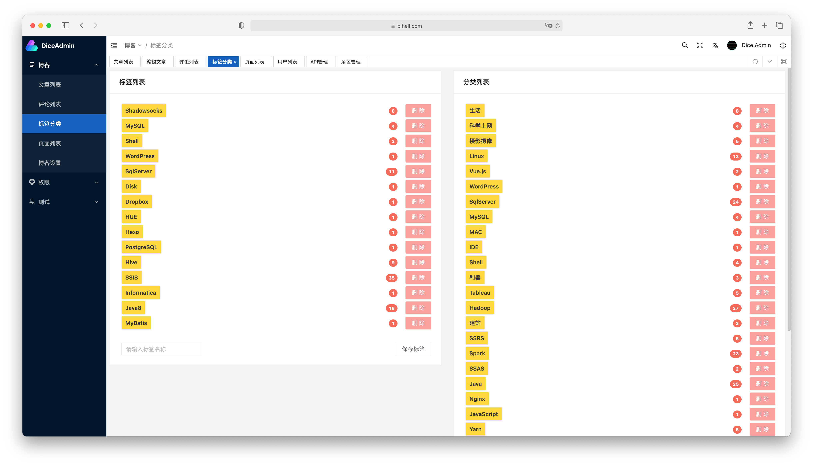

<p align="center">
  
</p>

<p align="center">
    <a href="https://www.travis-ci.org/bihell/Dice"></a>
    <a href="https://codebeat.co/projects/github-com-bihell-dice-master"></a>
    <a href="https://github.com/bihell/Dice/blob/master/LICENSE"></a>
    <a alt="spring boot"></a>
    <a alt="spring boot"></a>
    <a alt="vue"></a>
    <a alt="nuxt"></a>
    <a alt="docker"></a>
    <a alt="docker-compose"></a>
</p>

* 基于`node` `java` `spring-boot` `vue` `nuxt` 开发的个人管理系统
* 功能精简但齐全，界面简洁却美观，满足个人日常使用要求
* 项目会持续更新，如果有不完善的地方，欢迎指出

> 演示站点：[博客前端](https://bihell.com/) [管理前端](https://bihell.com/admin)  
> 因管理前端的权限还未开发完毕，因此不提供Demo账号，有兴趣的小伙伴可自行下载源码运行
> QQ群：787519476

## 一、部分界面









## 二、参与开发

目前管理前端刚切为vue3，很多功能细节需要完善。打算做一个导航模块，支持用户自定义导航的收录管理和展示。后续精力主要放在导航这块。

> 请确保系统中已经安装`docker`、`docker-componse`、`nodejs`、`npm`、`Java9`、`Redis`、`MySQL`等必须的依赖。

### 2.1 安装依赖（MacOS）

#### Java

```Bash
brew tap homebrew/cask-versions
brew cask install java11
```

#### MySQL

```Bash
brew install mysql
mysql.server start
```

#### Redis

```Bash
brew install redis
brew services start redis
```

### 2.2 愉快的开发吧

克隆项目到本地

   ```
   git clone https://github.com/bihell/Dice.git
   ```

#### 2.2.1 `dice-server` Java后台

项目使用lombok插件，如果要在ide中调试要有lombok插件
数据库初始语句:dice-server/bootstrap/src/main/resources/init.sql

##### 2.2.1.1 修改相应配置

进入服务端文件夹`cd dice-server`,修改spring-boot配置文件`vi src/main/resources/application-dev.properties`

```
spring:
    datasource:
      driverClassName: com.mysql.cj.jdbc.Driver
      url: jdbc:mysql://localhost:3306/dice?useUnicode=true&characterEncoding=utf-8&useSSL=false&serverTimezone=Asia/Shanghai
      username: root
      password: root
```

将数据库的用户名和密码修改成对应你数据库的用户名密码

##### 2.2.1.2 项目启动

多种启动方式：

1. 直接运行main方法

直接在IDE中运行`bootstrap`模块的`DiceApplication`启动类的main方法就可以看到项目启动了。

2. 打包启动

```Bash
mvn clean package -P docker,release
java -jar bootstrap/target/bootstrap-2.0.jar
```

#### 2.2.2 `dice-front` 博客前端

进入前端文件夹`cd dice-front`，安装依赖并启动服务：

```Bash
npm install
npm run dev
```

#### 2.2.3 `dice-admin` 管理前端

进入后端文件夹`cd dice-admin`，安装依赖和启动服务：

```Bash
npm install
npm run dev
```

> 如果你的MySQL版本较新，可能会碰到无法连接的错误。可以重新设置一下账号权限，方式如下：

> ```
> ALTER USER 'root'@'localhost' IDENTIFIED WITH mysql_native_password BY 'password'
> flush privileges;
> ```

#### 2.2.4 访问

`http://localhost:3000/` 为博客前端首页

`http://localhost:3100/admin/` 为管理后台首页

